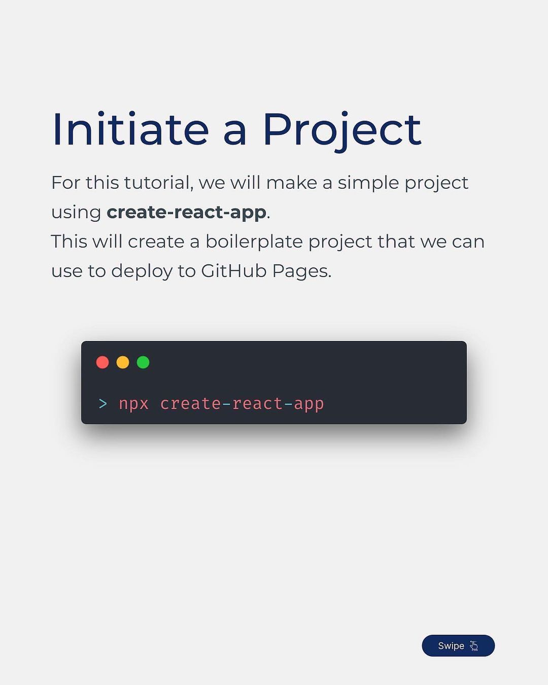
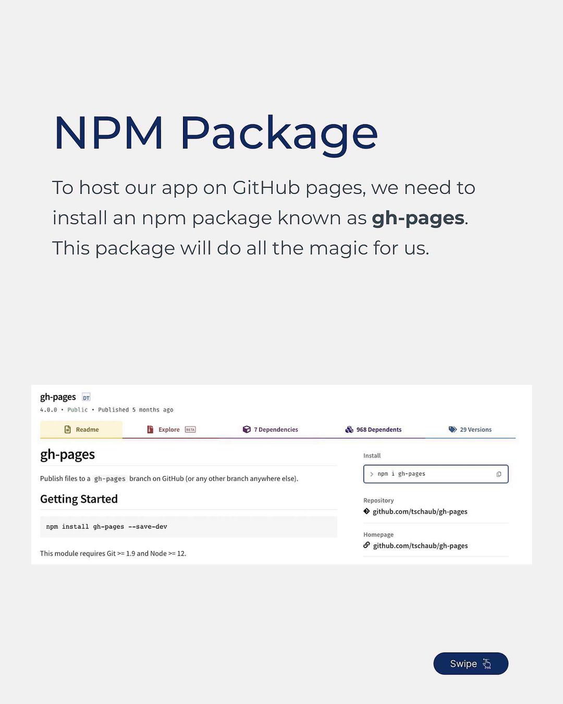
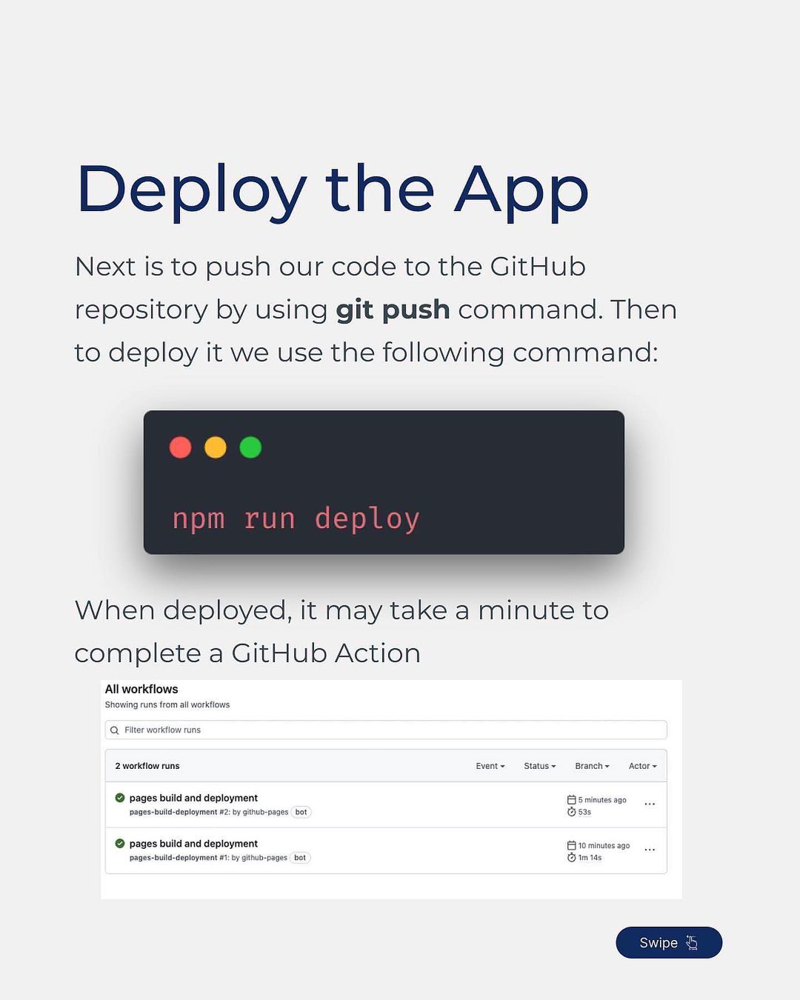

# React + TypeScript + Vite

This template provides a minimal setup to get React working in Vite with HMR and some ESLint rules.

Currently, two official plugins are available:

- [@vitejs/plugin-react](https://github.com/vitejs/vite-plugin-react/blob/main/packages/plugin-react/README.md) uses [Babel](https://babeljs.io/) for Fast Refresh
- [@vitejs/plugin-react-swc](https://github.com/vitejs/vite-plugin-react-swc) uses [SWC](https://swc.rs/) for Fast Refresh

## Expanding the ESLint configuration

If you are developing a production application, we recommend updating the configuration to enable type aware lint rules:

- Configure the top-level `parserOptions` property like this:

```js
export default {
  // other rules...
  parserOptions: {
    ecmaVersion: 'latest',
    sourceType: 'module',
    project: ['./tsconfig.json', './tsconfig.node.json'],
    tsconfigRootDir: __dirname,
  },
}
```

- Replace `plugin:@typescript-eslint/recommended` to `plugin:@typescript-eslint/recommended-type-checked` or `plugin:@typescript-eslint/strict-type-checked`
- Optionally add `plugin:@typescript-eslint/stylistic-type-checked`
- Install [eslint-plugin-react](https://github.com/jsx-eslint/eslint-plugin-react) and add `plugin:react/recommended` & `plugin:react/jsx-runtime` to the `extends` list


# GitHub Pages
GitHub Pages is a services by GitHub that let you publish your website directly on GitHub from a Git repository.
You can use your own custom domain with a SSL certificate for free.

## Note 
   The GitHub pages work for static websites only including a React.js, and Nextjs application.

## Initiate a Project
   we  will  make  a  simple  project using `create-react-app`
This  will  create  a  boilerplate  project  that  we  can use to deploy to GitHub Pages.

### npx create-react-app app-name



## NPM Package
To host our app on GitHub pages, we need to install an npm package known as **gh-pages**. 
This package will do all the magic for us.

## Setup Package.json
Next is to add some configuration in our **package.json**  file. Head over to the scripts section and add the following commands:

```js
"scripts": {
    "predeploy": "npm run build",
    "deploy": "gh-pages -d build"
}
```

We also need to add homepage property with value [https://[username].github.io/[repo-name]](value https://[username].github.io/[repo-name] ) 
```js
"homepage": "https://vijayasarathi.github.io/react-deploy/developer-portfolio",
```

## Deploy the App
Next is to push our code to the CitHub repository by using git push command. 
Then to deploy it we use the following command:

### npm run deploy



When deployed, it may take a minute to complete a GitHub Action.

## Our Website is Live
### Congratulations
By completing all those steps, our website is live now.


If you’re not sure about the website URL, you can go to **Settings > Pages**, there you can find the URL